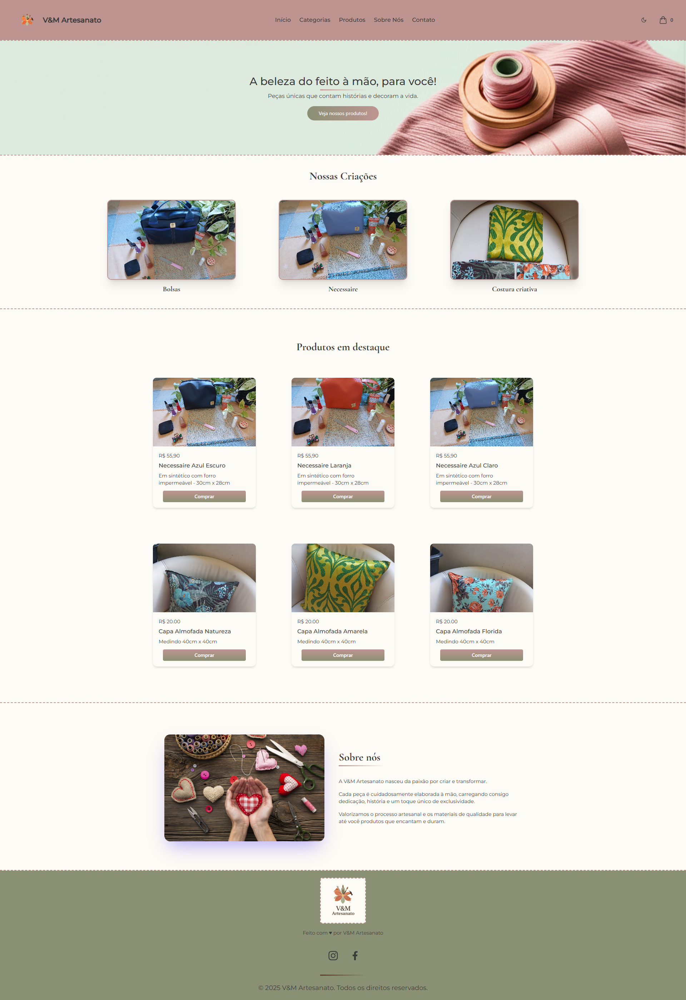

## V&M Artesanato — Feito com amor!


Site estático e responsivo para apresentação e venda de produtos artesanais.

## 📸 Screenshot



---

### 📑 Índice
- [Screenshot](#-screenshot)
- [Descrição](#-descrição)
- [Linguagens e Tecnologias](#-linguagens-e-tecnologias)
- [Funcionalidades](#-funcionalidades)
- [Estrutura do projeto](#-estrutura-do-projeto)
- [Como executar](#-como-executar)
- [Créditos](#-créditos)

## 📋 Descrição
Este projeto foi solicitado por uma empresa de artesanato para a apresentação e venda de seus produtos.

## 🧩 Linguagens e Tecnologias

- **Linguagens**
  - HTML
  - CSS
  - JavaScript

- **Bibliotecas e serviços**
  - Tailwind CSS (Browser v4 via CDN)
  - Modern Normalize (reset CSS via CDN)
  - Google Fonts (Cormorant Garamond e Montserrat)
  - TailwindPlus Elements (componentes utilitários via CDN)

## ✨ Funcionalidades
- 🌙/☀️ Modo claro/escuro com persistência em localStorage
  - Alternância de tema e sincronização visual dos botões (light/dark)
- 📱 Menu mobile deslizante (abrir/fechar)
  - Bloqueio de scroll do body, fechamento por clique em links, overlay e tecla ESC
- 🧭 Navbar com navegação por âncoras: Início, Categorias, Produtos, Sobre Nós e Contato
- 🖼️ Seção Hero com chamada para ação para visualizar produtos
- 🏷️ Seção Categorias com cards de destaque
- 🛍️ Seção Produtos em destaque com cards (imagem, preço, descrição e botão "Comprar")
- 🧵 Seção Sobre Nós com imagem e descrição institucional
- 🔗 Rodapé com logo e links para Instagram e Facebook
- 📐 Layout responsivo (flex/grid), transições e efeitos de hover
- 🎨 Paleta de cores e fontes configuradas via tokens do Tailwind (@theme)
- ♿ Acessibilidade básica (atributos ARIA e suporte à tecla ESC no menu)

## 🗂️ Estrutura do projeto
```
/
├─ index.html               # Página principal do site
├─ script.js                # Interatividade: tema e menu mobile
└─ assets/
   ├─ css/
   │  └─ tailwins.css       # (Opcional) Estilos adicionais do projeto
   ├─ img/                  # Logos, banners e imagens gerais
   │  ├─ artesanato_semfundo.png
   │  ├─ artesanato-amor.jpeg
   │  ├─ hero_image_artesanato_semtexto.png
   │  ├─ hero_image_artesanato2_resized.png
   │  ├─ logo_minimalista_flor.svg
   │  ├─ logo-2.png
   │  ├─ logo-sem-fundo.png
   │  └─ logo-semtexto.png
   └─ produtos/             # Imagens dos produtos
      ├─ almofadaflorida.jpeg
      ├─ almofadanatureza.jpeg
      ├─ almofadaverde-amarela.jpeg
      ├─ bolsazul.jpeg
      ├─ necessaire azul claro.jpeg
      ├─ necessaireazulescuro.jpeg
      ├─ necessairelaranja.jpeg
      └─ panosdealmofada.jpeg
```

## ▶️ Como executar
1. Faça o download/clonagem do projeto.
2. Abra o arquivo `index.html` diretamente no seu navegador (duplo clique).
   - Alternativamente, sirva a pasta com um servidor estático (ex.: Live Server, http-server, etc.).

## 🙌 Créditos
- Imagem da logo e do banner: geradas pelo Google Gemini
- JavaScript: gerado com o auxílio do Cursor
